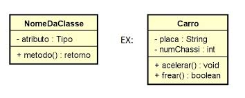
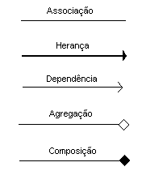
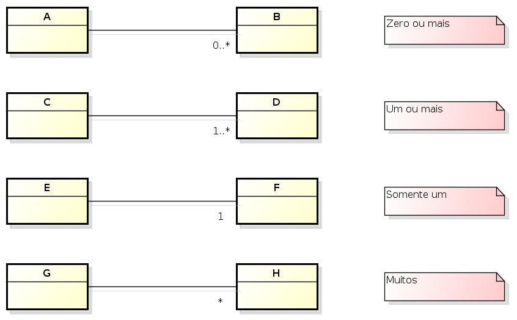
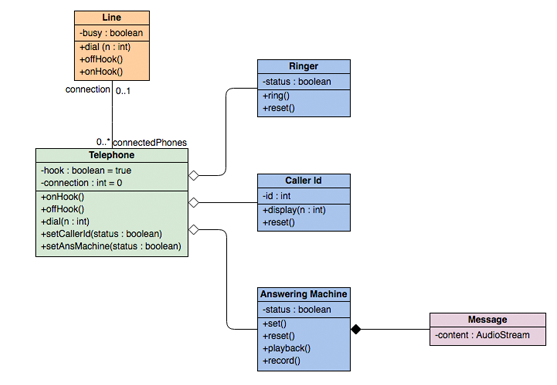

# 📑UML - Linguagem de Modelagem Unificada

Notação que possibilita a representação gráfica de um projeto.

Três conceitos básicos: 
- **Diagramas**
- **elementos**
- **relacionamentos**

As notações UML são distribuídas em duas categorias de diagramas, a estrutural e a comportamental.

## 🏛️Diagramas Estruturais

- **Diagrama de Classe:** É utilizado para fazer a representação de estruturas de classes de negocio, interfaces e outros componentes do sistema.

- **Diagrama de Objetos:** Representa os objetos existentes em um determinado instante ou fato na aplicação. Obtendo assim uma perspectiva do estado de nossos objetos mediante a interação dos usuários no sistema.

- **Diagrama de Componentes:** Mostra a relação estrutural dos componentes de um sistema de software. Estes são utilizados principalmente quando se trabalha com sistemas complexos com muitos componentes.

- **Diagrama de Implantação:** Mostra o hardware do seu sistema e o software nesse hardware. Os diagramas de implantação são úteis quando a sua solução de software é implantada em várias máquinas, tendo cada uma delas uma configuração única.

- **Diagrama de Pacote:** Como o nome sugere, um diagrama de pacotes mostra as dependências entre os diferentes pacotes de um sistema.

- **Diagrama de Estruturas Compostas:** São usados para mostrar a estrutura interna de uma classe.

## 🎭Diagramas Comportamentais

- **Diagrama de Caso de Uso:** Eles dão uma visão gráfica dos atores envolvidos em um sistema, diferentes funções necessárias para esses atores e como essas diferentes funções interagem. É um ótimo ponto de partida para qualquer discussão de projeto porque você pode identificar facilmente os principais atores envolvidos e os principais processos do sistema.

- **Diagrama de Atividade:** Representam fluxos de trabalho de uma forma gráfica. Podem ser utilizados para descrever o fluxo de trabalho empresarial ou o fluxo de trabalho operacional de qualquer componente de um sistema.

- **Diagrama de Maquina de Estado:** Descrevem o comportamento de objetos que agem de forma diferente de acordo com o estado em que se encontram no momento. 

- **Diagrama de Sequência:** Mostram como os objetos interagem uns com os outros e a ordem em que essas interações ocorrem.

- **Diagrama de Comunicação:** São semelhantes aos diagramas de sequência, mas o foco está nas mensagens passadas entre objetos.

- **Diagrama de Visão Geral da Interação:** Enquanto os diagramas de atividade mostram uma sequência de processos, os diagramas de visão geral de interação mostram uma sequência de diagramas de interação. São um conjunto de diagramas de interação e a ordem em que acontecem. 

- **Diagrama do tempo:** Eles representam o comportamento dos objetos em um determinado período de tempo. Se for apenas um objeto, o diagrama é simples. Mas, se houver mais de um objeto envolvido, um diagrama de tempo é usado para mostrar interações entre objetos durante esse período de tempo.

## 📋Diagrama de Classe

Ilustra **graficamente** como as classes são estruturadas e interligadas entre si.

Em diagrama a estrutura das classes é constituída por:
- **Identificação:** Nome e/ou finalidade da classe.
- **Atributos:** Propriedade e/ou características;
- **Operações:** Ações e/ou métodos;
- **Relacionamento**

  

### 🔗Relacionamentos

Em um diagrama de classes podem existir de forma independentes, mas obviamente haverá em alguma etapa da aplicação a necessidade de algumas se relacionarem, o que devemos compreender é o nível de dependência entre elas:

  

- **Associação:** Uma associação define um relacionamento entre duas classes, permitindo que um objeto tenha a estrutura de um outro objeto.

- **Herança:** Relacionamento entre um elemento mais geral e um mais específico. Onde o elemento mais específico herda as propriedades e métodos do elemento mais geral.

- **Dependências:** São relacionamentos em que uma mudança em um elemento da classe principal altera um elemento da classe dependente.

- **Agregação:** A classe principal contém uma relação com outra classe mas ela pode existir sem a classe agregadora. Exemplo, em um cadastro de candidatos, podemos encontrar candidatos que ainda não possuam uma profissão.

- **Composição:** Possui uma dependência existencial entre a classe principal e a classe associada. Exemplo, uma admissão só poderá existir contendo as informações básicas de um candidato selecionado. 

### 🧮Multiplicidade

Nem sempre o relacionamento entre as classes será de **um para um**, um determinado cenário poderá exigir multiplicidades especificas conforme a imagem a seguir. 

  

### 👁️Visibilidade

Os atributos e métodos de uma classe podem receber níveis de visibilidade, e na UML existem símbolos que representam cada um deles.

- (+) Visibilidade publica
- (#) Visibilidade protegida (muito associada com herança)
- (-) Visibilidade privada

### Exemplo

  

